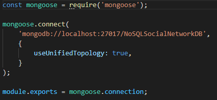
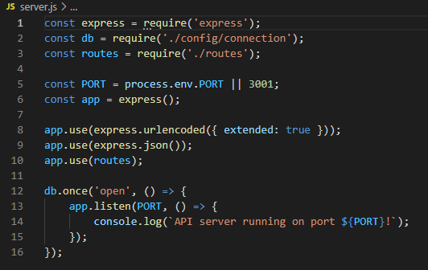
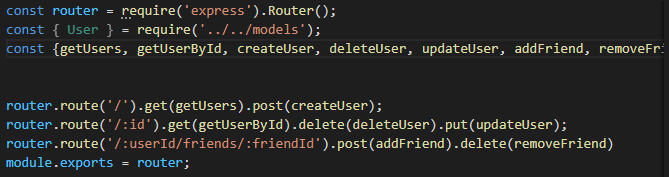
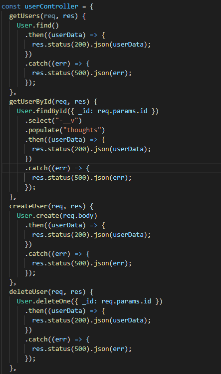
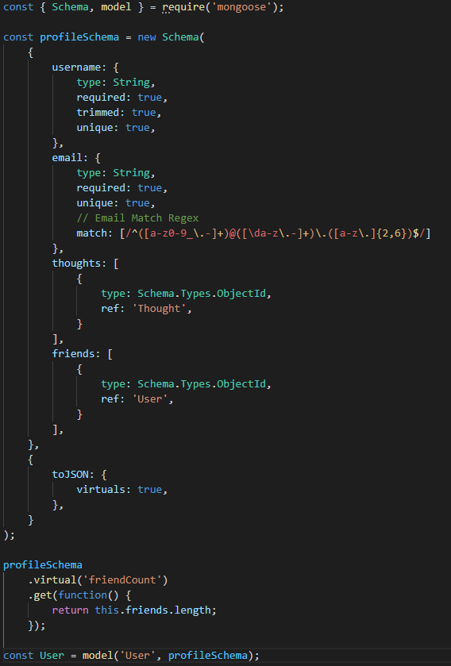
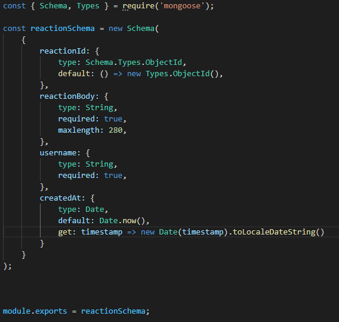

# NBM-NoSQL-Social-Network-API

## USER STORY

    AS A web developer
    I WANT to create a backend database API for a social network using NoSQL,MongoDB and Mongoose
    SO THAT users can easily add, update, or remove profiles, friends, thoughts and reactions.

## TABLE OF CONTENTS

- [DESCRIPTION](#description)
- [INSTALLATION](#installation)
- [LICENSE](#license)
- [CONTRIBUTING](#contributing)
- [QUESTIONS](#questions)

## DESCRIPTION

This is a backend database API that utilizes NoSQL modules like MongoDB and Mongoose to run a social network service. The service allows for users to create user profiles, react to posts(thoughts), add/delete friends and update posts and information.

## APPLICATION IN USE

LINK TO APPLICATION IN USE VIDEO

## INSTALLATION

I began this process by creating my server.js and connection.js files to build a boilerplate foundation to build my models and controllers off of. The next step was to create my models for Users, Reactions, and Thoughts based on the parameters set in the assignments acceptance criteria. The next step was to create my routes files and build basic get requests to test the functionality of the application and check for errors.

Connection.js File

Server.js File

User Routes File

User Controllers

Profile Schema Model

Reaction Schema for Thoughts

## LICENSE

The license included for the project is under MIT

## CONTRIBUTING

UW Full-Stack Web Development Boot Camp Class Repo - Week 18 NoSQL
https://uwa.bootcampcontent.com/UWA-Bootcamp/uw-blv-virt-fsf-pt-12-2021-u-c/-/tree/master/18-NoSQL

## QUESTIONS

If you have any further questions about this module or improvement ideas, please feel free to connect on either GitHub or LinkedIn, or email me at:

- GitHub: https://github.com/NathanMilburn
- LinkedIn: https://www.linkedin.com/in/nathan-milburn-55487513a/
- E-Mail: nathan.milburn@outlook.com